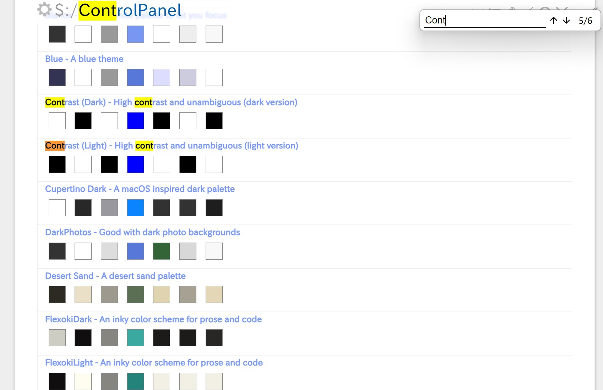

## 介绍

基于 electron 的 TiddlyWiki 启动器，支持单文件版和 Node.js 版，没有冗余的 UI 元素。

## 下载

[本体](https://github.com/LinHQ1999/TiddlyWiki-electron/actions/workflows/electron.yml)

## 功能

### 增强功能（需要安装插件）

**将 td-plugins.json 拖至你的 wiki 以添加增强功能**：

1. 单文件保存支持。
2. 拖拽时自动将文件存储到 files 目录中。
3. 一键将内嵌文件转换并存储到 files 目录中。
4. 启动时自动清理多余附件。
5. windows 上弹出提示不会丢失输入焦点。

### 基本功能

**Windows 上菜单栏自动隐藏，按 alt 键打开菜单栏**。

- 打开 wiki
- 打开 wiki 所在目录
- 在浏览器中打开
- 重载 Node.js TiddlyWiki 服务
- 页面内搜索

## 环境

由于**没有**集成 tiddlywiki 本身，所以：

> 需要安装 nodejs 版 tiddlywiki
> 确保以下命令能够在终端中执行

1. `npm root -g`
2. `tiddlywiki`

## 构建

1. 安装依赖：`pnpm i`
2. 开发环境：`pnpm start`
3. 打包： `pnpm dist`
